# Dodo Payments


## 1. Database Models
## 1. Data Model & Spatial Indexes

The architecture utilizes a relational PostgreSQL schema to guarantee ACID transaction boundaries and enforce absolute logical isolation across multi-tenant spaces.

### Physical Entity-Relationship (ER) Schema Map

```text
               ┌────────────────────────────────────────────────────────┐
               │                      businesses                        │
               ├────────────────────────────────────────────────────────┤
               │  id             : uuid          (PK)                   │
               │  name           : varchar                              │
               │  api_key_hash   : varchar                              │
               │  webhook_url    : varchar                              │
               │  wh_secret      : varchar                              │
               └───────────────┬────────────────────────┬───────────────┘
                               │                        │
                    (1 to Many)│                        │(1 to Many)
                               ▼                        ▼
┌──────────────────────────────────────────────────────┐ ┌──────────────────────────────────────────────────────┐
│                   idempotency_keys                   │ │                      customers                       │
├──────────────────────────────────────────────────────┤ ├──────────────────────────────────────────────────────┤
│  idempotency_key : varchar      (PK)                 │ │  id             : uuid          (PK)                 │
│  business_id     : uuid         (PK/FK) ──►[To Biz]  │ │  business_id    : uuid          (FK) ──► businesses  │
│  request_hash    : varchar                           │ │  name           : varchar                            │
│  response_status : int4                              │ │  email          : varchar                            │
│  response_body   : jsonb                             │ └──────────────────────────┬───────────────────────────┘
└──────────────────────────────────────────────────────┘                            │
                                                                                    │ (1 to Many)
                                                                                    ▼
                                                         ┌──────────────────────────────────────────────────────┐
                                                         │                       invoices                       │
                                                         ├──────────────────────────────────────────────────────┤
                                                         │  id             : uuid          (PK)                 │
                                                         │  business_id    : uuid          (FK) ──► businesses  │
                                                         │  customer_id    : uuid          (FK) ──► customers   │
                                                         │  state          : varchar                            │
                                                         │  total_amt      : bigint                             │
                                                         │  due_date       : timestamptz                        │
                                                         └───────────────┬──────────────────────────┬───────────┘
                                                                         │                          │
                                                              │ (1 to Many)              │ (1 to Many)
                                                                         ▼                          ▼
                                                         ┌──────────────────────────────┐ ┌──────────────────────────────┐
                                                         │        invoice_items         │ │       payment_attempts       │
                                                         ├──────────────────────────────┤ ├──────────────────────────────┤
                                                         │  id          : uuid     (PK) │ │  id          : uuid     (PK) │
                                                         │  invoice_id  : uuid     (FK) │ │  invoice_id  : uuid     (FK) │
                                                         │  description : text          │ │  status      : varchar       │
                                                         │  quantity    : int4          │ │  psp_referenc: uuid          │
                                                         │  unit_cents  : bigint        │ │  error_code  : varchar       │
                                                         └──────────────────────────────┘ └──────────────────────────────┘
```

### Per-Table Detailed Structural Analysis

#### 1. `businesses`
* **Shape**: Multi-tenant configuration root mapping merchant metadata and webhook routes.
* **Primary Key**: `UUIDv4` (prevents sequential enumeration attacks).
* **Index Profile**: Unique B-Tree on `api_key_hash` ($O(\log N)$ auth verification).
* **Design Choice**: Relational row storage guarantees instant availability to database connection pools during initial request parsing.
* **100x Scale Strategy**: Mirror keys to a globally distributed Redis cache pool with an LRU eviction policy to offload auth lookups from the persistent disk.

#### 2. `customers`
* **Shape**: Tenant-bound client identity profiles.
* **Primary Key**: `UUIDv4`.
* **Index Profile**: Unique composite B-Tree on `(business_id, email)`.
* **Design Choice**: Composite indexing allows separate merchants to register the same client email without key collision or cross-tenant data leaks.
* **100x Scale Strategy**: Enforce `ON DELETE RESTRICT` against active downstream invoice relations to guarantee strict tax audit preservation.

#### 3. `invoices`
* **Shape**: Central transaction state ledger tracking lifecycles and balances.
* **Primary Key**: `UUIDv4`.
* **Index Profile**: Composite B-Tree on `(business_id, state)`.
* **Design Choice**: Hardlocked to a `BIGINT` minor-unit scalar (cents) to completely eliminate floating-point decimal calculation errors.
* **100x Scale Strategy**: Accelerates system dashboard filters from $O(N)$ scans down to $O(\log N)$ lookups. Terminal rows (`PAID`, `VOID`) partition out horizontally into automated seasonal cold-storage tables.

#### 4. `invoice_items`
* **Shape**: Granular cart line-item specifics (quantities and item unit costs).
* **Primary Key**: `UUIDv4`.
* **Index Profile**: Standard B-Tree on foreign key `invoice_id`.
* **Design Choice**: Normalization isolates volatile line changes safely within the `DRAFT` state without corrupting core parent ledger schemas.
* **100x Scale Strategy**: Anchored by an active `ON DELETE CASCADE` rule to guarantee self-cleaning transactional purges when temporary draft items drop.

#### 5. `payment_attempts`
* **Shape**: Append-only chronological history logging outbound bank handshakes.
* **Primary Key**: `UUIDv4`.
* **Index Profile**: Standard B-Tree on foreign key `invoice_id`.
* **Design Choice**: An immutable tracking registry preserves system audit trails when handling partial network drops or failed gateway captures.
* **100x Scale Strategy**: Locked by an application-wide `ON DELETE RESTRICT` policy. High-volume streams bypass core disk space entirely via pipeline loading into cold compliance data lakes.

#### 6. `idempotency_keys`
* **Shape**: High-speed protective gateway intercepting incoming client request signatures.
* **Primary Key**: Composite constraints `PRIMARY KEY (idempotency_key, business_id)`.
* **Index Profile**: Implicit unique composite B-Tree index.
* **Design Choice**: Namespace isolation lets distinct merchants reuse standard internal order numbers safely without global collision risks.
* **100x Scale Strategy**: Condenses payload values into clean `SHA-256` request hashes before moving the hot-path entirely to an in-memory Redis cluster with a strict 24-hour TTL.

---

## 2. Invoice State Machine Engine

The invoice state machine acts as the traffic controller for your entire billing pipeline. Its job is to ensure that an invoice moves from creation to completion through a clear, predictable path where nothing can break. By enforcing strict, un-skippable status steps, the engine prevents critical payment bugs—such as charging a client's card twice for the same order, dropping a transaction if their internet cuts out mid-flight, or altering financial records after a bill has already been paid.

### Critical Transition Mechanics

#### 1. The Concurrency Shield (`OPEN` ──> `PROCESSING`)
* **What happens**: The moment a user clicks pay, the system instantly locks the invoice row in the database and changes its status to `PROCESSING`.
* **Why it matters**: If the user double-clicks the button, the second request is blocked by the database lock, reading the `PROCESSING` status and failing safely. This completely prevents double-charging the customer.

#### 2. The Graceful Recovery Loop (`PROCESSING` ──> `OPEN`)
* **What happens**: If the bank gateway declines the credit card (e.g., insufficient funds or wrong CVV), the invoice flips right back to `OPEN`.
* **Why it matters**: It logs the failed attempt but immediately unlocks the invoice so the customer can try a different card or fix their typing error without losing their cart items.

#### 3. Terminal Finality Barriers
* **What happens**: Once an invoice hits `PAID`, `VOID`, or `UNCOLLECTIBLE`, it is permanently locked down.
* **Why it matters**: The server checks the status at the very start of a request. If the invoice is already finished, it stops the payment route immediately (`HTTP 422`), guaranteeing you never accidentally charge an already paid bill.

```mermaid
graph TD
    D[DRAFT] -->|Trigger: POST /api/v1/invoices| O[OPEN]
    O -->|Trigger: POST /api/v1/invoices/id/pay| PL[PROCESSING]
    PL -->|Trigger: Gateway Success Callback| PAID[PAID]
    PL -->|Trigger: Gateway Decline Response| O
    O -->|Trigger: DELETE /api/v1/invoices/id| V[VOID]
    O -->|Trigger: Automated Cron Due-Date Check| U[UNCOLLECTIBLE]

    style PAID fill:#1b5e20,stroke:#333,stroke-width:2px
    style V fill:#37474f,stroke:#333,stroke-width:2px
    style U fill:#b71c1c,stroke:#333,stroke-width:2px


```



### State Specifications & Finality Matrix

| State Name | Terminal Status? | Operational Meaning |
| :--- | :--- | :--- |
| **`DRAFT`** | No | The invoice is still being compiled. Line items can be freely added, modified, or removed. |
| **`OPEN`** | No | The invoice total is calculated and locked. The engine is actively waiting for payment allocation. |
| **`PROCESSING`** | No | In-flight state lock indicating a remote PSP gateway payment attempt is currently executing. |
| **`PAID`** | **Yes (Terminal)** | Financial success. Funds are captured permanently. Row becomes entirely immutable. |
| **`VOID`** | **Yes (Terminal)** | Administrative cancellation. Used to discard mistakes *before* any money passes through a bank. |
| **`UNCOLLECTIBLE`** | **Yes (Terminal)** | Bad debt write-off. The invoice exceeded its due-date timeline and all automated retry sequences failed. |


---

## 3. Payment Correctness & Failure Modes Deep Dive

### Concurrency Mechanism Selection: Row-Level Pessimistic Locking
We explicitly implement a **Row-Level Pessimistic Lock** (`SELECT ... FOR UPDATE`) inside an isolated, atomic transaction block over alternatives like Optimistic Concurrency Control (OCC) or status-conditional updates. 
While OCC works well in low-contention systems, it forces expensive application-level retries when conflicts occur. In high-concurrency payment routing, failing early and holding an absolute transaction line directly at the database layer safely prevents race conditions during downstream network calls to the external API gateway.

### Failure Scenario Walkthroughs

#### (a) Dual Simultaneous Requests (`POST /invoices/{id}/pay`)
When two clients fire a pay command at the exact same millisecond, the database grants exclusive row access to Thread A via the lock layer. Thread B is suspended. Thread A verifies the status is `OPEN`, upgrades it to `PROCESSING`, commits, and releases the database fence. Thread B wakes up, reads the mutated `PROCESSING` flag, and is instantly rejected with an error payload. Only one payment charge ever reaches the gateway.

#### (b) Payment Service Provider (PSP) Timeout (`tok_timeout`)
Our application client establishes a strict 5-second deadline cutoff on the outbound connection pool. If the simulator hits a timeout rule (30-second hang), our app cuts the request line safely, logs the instance status inside `payment_attempts` as `pending`, leaves the invoice row trapped in `PROCESSING`, and returns an immediate `HTTP 202 Accepted` to the client. The client finds the eventual result by initiating structured polling against the `GET /invoices/{id}` endpoint.

#### (c) Crash Post-PSP Success, Pre-Persistence
If the bank captures funds but our engine container crashes before committing the database transaction, the invoice remains stuck in `PROCESSING` on recovery. When the client retries the action using the same `Idempotency-Key`, the system detects an in-flight duplicate lookup holding a `NULL` response footprint. Instead of double-charging, the recovery pipeline triggers an out-of-band verification callback to the PSP to fetch the original bank reference, resolving the row status to `PAID` safely.

#### (d) Idempotency Key Reuse with Mutated Body
If a merchant attempts to recycle an idempotency key but alters payload fields (such as modifying the total transaction amount), the request gate blocks it immediately. We store a cryptographic `request_hash` (SHA-256) inside the table. If an incoming signature does not perfectly match the historical registration vector, the engine returns an explicit `HTTP 400 Bad Request` to prevent payload hijacking.

#### (e) Duplicate Actions Against Terminal States
If an invoice is locked as `PAID` and a secondary payload triggers a `POST /pay` path, the transaction middleware catches the status flag immediately. Because it violates the state machine progression map, the route terminates with an `HTTP 422 Unprocessable Entity` before ever allocating external payment network pipes.

---

## 4. Webhook Pipeline Architecture

### Core Delivery Engineering

* **Signing Scheme**: Webhook payloads are compiled into JSON string bodies and signed using a cryptographic `HMAC-SHA256` digest combined with the merchant's private `webhook_secret`. The output is passed inside an `X-Dodo-Signature` header accompanied by a Unix epoch header value (`X-Dodo-Timestamp`) to prevent replay manipulation vectors.
* **Retry Engine Configuration**: 
  * **Interval Array**: 2s, 4s, 8s, 16s, 32s.
  * **Maximum Setup Attempts**: 5 Retries.
  * **Total Time Budget**: 62 Seconds.
* **Exhausted Budgets & Reconciliation**: If an endpoint completely exhausts all 5 retries, the record is flagged as `failed` and written into a dead-letter log table. Merchants can audit missed hooks by executing manual reconciliation requests via a dedicated syncing endpoint or by running differential checks against our core `GET /invoices` tracking paths.
* **Decoupled Delivery Pipeline**: Webhook delivery is entirely offloaded from the core synchronous API execution timeline using native asynchronous green threads (`tokio::spawn`). The main route handler logs the payload structure to the transaction thread and instantly returns an HTTP response to the caller within milliseconds, completely insulating the system from latency bottlenecks on external client servers.


---
---

## 5. API Key Infrastructure Model

### Operational Management & Security

* **Generation Framework**: Keys are constructed using a cryptographically secure random number generator (CSPRNG), returning 32 bytes of entropy wrapped in a human-scannable prefix layout: `dodo_live_[Secure_Base64_URL_Encoded_Bytes]`.
* **Storage Invariance**: Plaintext API tokens are never written to disk. The application calculates a one-way `SHA-256` string signature (`api_key_hash`) upon creation. Only the resulting hash is stored, ensuring that a total database compromise yields zero usable authentication vectors to an attacker.
* **Transmission Profile**: Keys must be passed inside standard secure transport channels using the standard HTTP authentication header scheme: `Authorization: Bearer dodo_live_...`.
* **Rotation & Revocation Paths**: The business settings panel exposes an immediate invalidation route. When triggered, the database replaces the active hash vector with a tombstone entry, dropping all associated middleware access pools within a single clock cycle.
* **Blast Radius Minimization**: Because every database model checks its multi-tenant context using an explicit `business_id` composite validation constraint, an authenticated key leakage event isolates exposure entirely to that single merchant profile boundary.

---

## 6. What We Cut and Why

Every good design document explicitly states what was intentionally left out due to time constraints, showing a clear focus on core processing reliability:

1. **Enterprise Message Broker Architecture (Kafka / RabbitMQ)**: We explicitly excluded dedicated messaging clusters to adhere to our setup speed guidelines. Asynchronous operations like webhook retries are managed reliably using internal Tokio worker memory pools.
2. **Multi-Currency FX Engines**: The system is restricted entirely to USD integer values (`BIGINT` cents) to maintain focus on concurrency safety and state machine edge-cases without exposing calculations to floating-point rounding errors.
3. **Partial Refund / Overpayment Allocations**: Invoices must be settled in full matching the absolute ledger amount. We skipped partial capture architectures to ensure transaction stability during core evaluation.
4. **Advisory Database Locking Alternatives**: We skipped PG advisory locks because they decouple lock logic from raw transactional row state, adding code complexity and risking connection leak bugs if workers crash mid-flight.

---

---

## 7. Production Readiness Gaps

If this system were deployed to a production cluster tomorrow morning, the following three critical components would be missing:

1. **Distributed Memory Locking Tier (Redis Redlock)**: While local row-level database blocks (`SELECT ... FOR UPDATE`) ensure transaction safety on a single PostgreSQL server, they become a scalability hurdle if the app layer is scaled horizontally across separate regions. A distributed lock layer is necessary to handle cross-node execution safely.
2. **Automated Idempotency Key TTL Aging**: Currently, idempotency records remain inside database storage indefinitely. In a production environment, keys should be assigned a 24-to-48-hour expiration timeline (via Redis TTL or an automated background cleanup cron job) to prevent table bloating and performance degradation.
3. **Comprehensive Metrics & Distributed Tracing Framework**: The system needs OpenTelemetry integration coupled with Prometheus metric tracking to give developers immediate visibility into gateway latency, API error rates, and webhook processing bottlenecks.